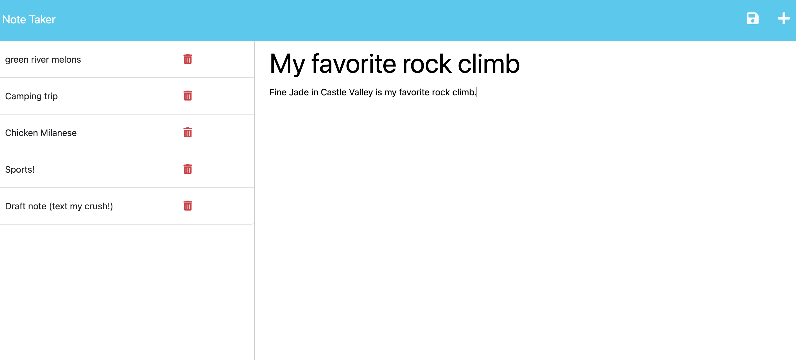

# noteTaker

## [Deployed Site](https://notetaker-production-495d.up.railway.app/) 

## Description
A simple note taking app that I developed the backend for. My motivation for this project was to learn how to use Express JS for backend server side work. During the project I learned a lot about routing. 

## Installation
In order to run this on your local machine you will need [Node JS](https://nodejs.org/en/download) installed. Once you have Node JS clone the repository and install the run npm i  in the command line to install the dependencies (express). You can use Node JS in the terminal to run the app on a local server. Use the command node server.js in the command line and open [the locally hosted server](http://localhost:3001/).

## Usage

To use the app click the blue 'Get Started' button on the center of the page. From there you can click the Note title and note text to edit them, to save, click the save icon that pops up next to the plus icon. To open other notes simply click them in the list of notes on the left side of the page. To make a new note, click the plus icon in the upper right hand corner. To delete a note click the trash can icon next to the note title in the list of notes.

Here is an example image:

## Credits

The Backend code (server.js file) was made by me, Nicholas Burr, the frontend of the app was developed by EDX2U for their bootcamp curriculum. I recieved some help from Dru Sanchez who is an EDX2U tutor. Additionally I recieved help from Mia (Don't know their last name, who is a BCS learning assistant.)

## License

This Project is open source, under the MIT License, refer to the license in the repository for specific details.

